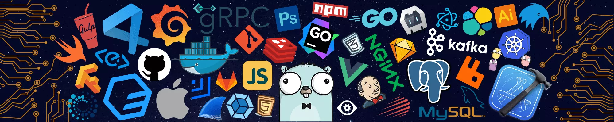

### Main:
- **Nickname:** PM-Kirill
- **Name:** Kirill
- **Birthday:** 30 June
- **Languages:** Russian and English
- **Country:** Belarus

### FAQ:
- Я создаю Discord ботов.
- Ещё я разработчик на 3-х хостингах и также создал свой, под названием PM-Nodes и CoreNodes.
- [PM-Nodes](https://discord.gg/QxKUVvC98Z) (Почти закрыт)
- [CoreNodes](https://corenodes.host) (Заморожен😢)
- [Baget-inc](https://baget-inc.online) (Закрыт)
- [Deplos]() (Закрыт)

- Я также увлечен Arduino и работаю над инструментом для фишинга под названием EspPortal v3. [Progress: ~40%].

<h2> My Skills  </h2>
 
### Programming Languages

  
  
  
  
  
  
  
  
  
  
  
  
  

### IDEs and Code Editors

  
  
  
  
  
  
  
  
  

### Package Managers and Build Tools

  
  
  
  
  
  
  

### Frameworks and Libraries

  
  
  
  
  
  
  
  
  
  

### Databases

  
  
  
  
  
  

### Connect with me:
- [Dev.to](https://dev.to/pmkirill)
- [YouTube](https://www.youtube.com/c/pm-kirill)
- [Discord](https://discord.gg/https://discordapp.com/users/1081189420780240917/)

Thanks to [Jetbrains](https://www.jetbrains.com/?from=inputmask) for providing a free license for their excellent Webstorm IDE.    

  

 
  Количество просмотров 
  

### Support:
[Buy Me a Coffee](https://www.buymeacoffee.com/PM-Kirill)

