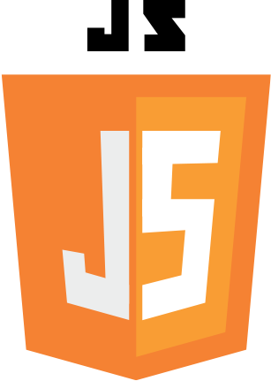
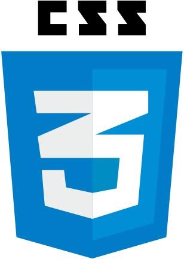

# Привет, я PM-Kirill! 👋

## О себе
Я - программист с увлечением к различным языкам программирования и разработке Discord-ботов. Моя страсть лежит в создании инновационных решений, взаимодействии с разнообразными технологиями и стремлении к непрерывному улучшению своих навыков.

## Языки программирования

## Discord боты
Я имею опыт в разработке Discord-ботов любой сложности на языке Python. С радостью создаю ботов, которые помогают автоматизировать задачи, улучшают опыт пользователей и вносят новые функциональные возможности.

## Опыт работы с хостингом
- [PM-Nodes](https://discord.gg/cyt6VJP67H) - создал и веду собственный хостинг
- [CoreNodes](corenodes.fun) - Активный разработчик хостинга
- [Deplos](deplos.com) - Помог с созданием бота Deplos ticket и дальше помогаю с написанием ботов

## Опыт в создании сервера Minecraft
В 2019-2022 годах я активно занимался созданием и администрированием сервера Minecraft под названием **ProstoMine**. Этот опыт позволил мне не только погрузиться в разнообразные аспекты серверного управления, но и расширить мои знания в языке программирования C++. В результате этого я начал писать свои собственные плагины для серверов на базе ядра **Paper**. Я оцениваю Paper как мощное ядро, обеспечивающее стабильность и производительность сервера Minecraft.

## Связаться со мной
Если у вас возникли вопросы, предложения или вы просто хотите пообщаться о программировании или других интересных темах, не стесняйтесь связаться со мной. Вы можете найти меня в следующих местах:
- Email: [your.email@example.com](mailto:your.email@example.com)
- Discord: PM-Kirill#1234

Буду рад пообщаться и сотрудничать с вами! 😊
